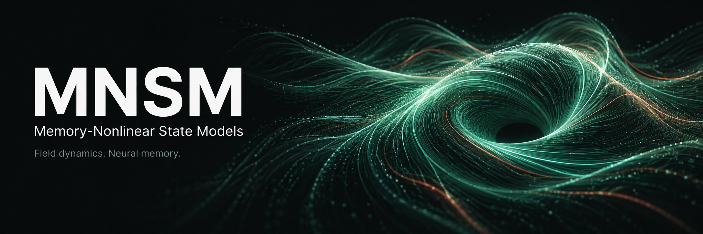
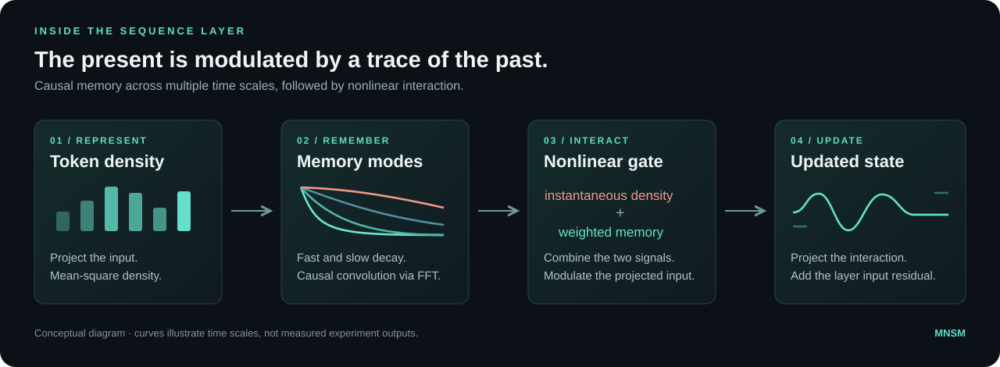
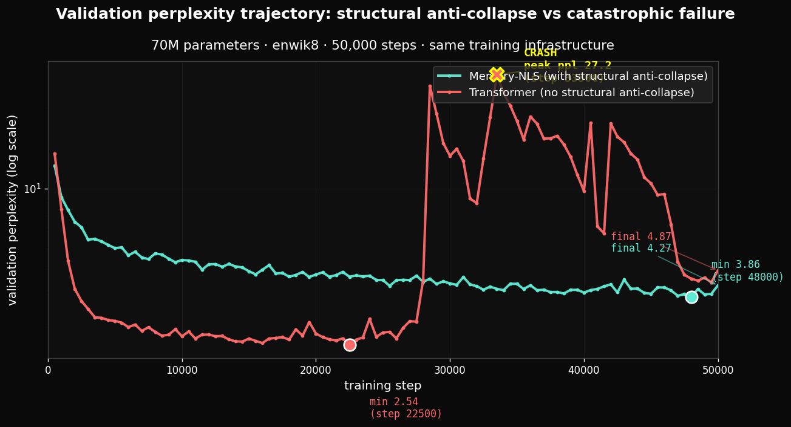
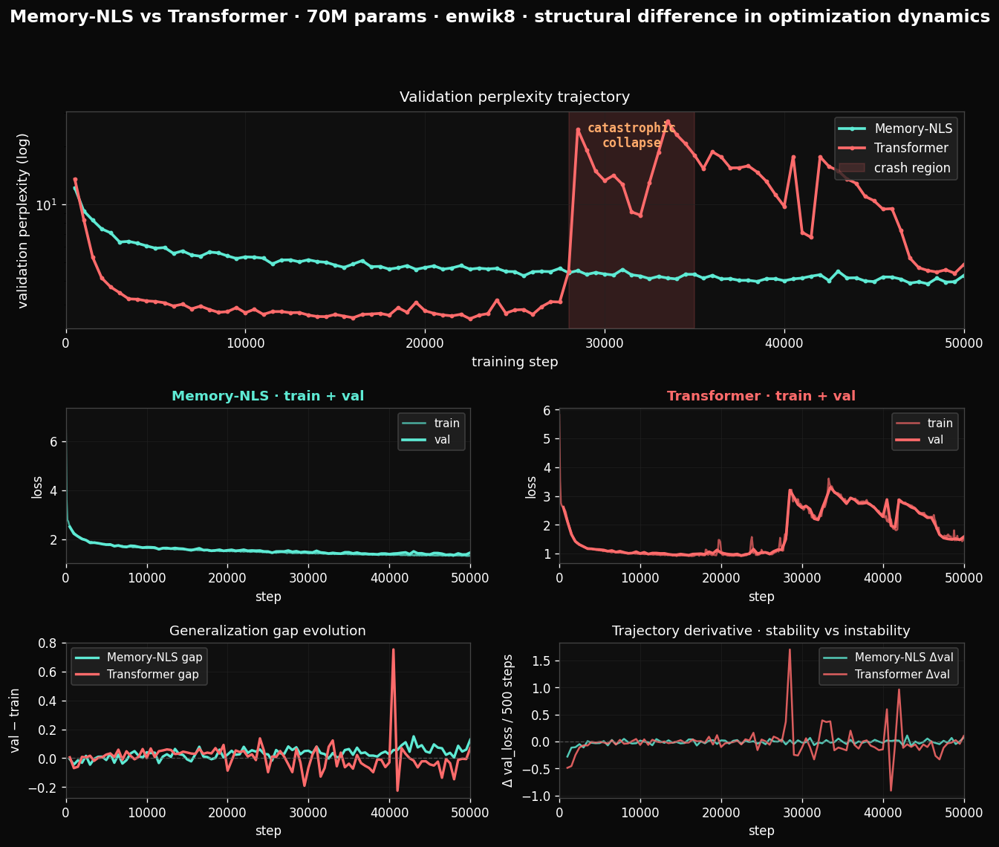

<p align="center">
  
</p>

<p align="center">
  <strong>A memory-driven sequence model, from field dynamics to language.</strong><br />
  Causal memory. Nonlinear interaction. Long-horizon training dynamics.
</p>

<p align="center">
  <a href="#the-idea">The idea</a> ·
  <a href="#inside-the-model">How it works</a> ·
  <a href="#the-recorded-experiment">Results</a> ·
  <a href="#try-it-locally">Try it</a> ·
  <a href="docs/pretrained.md">Pretrained models</a>
</p>

<table>
  <tr>
    <td align="center" width="33%"><h3>≈71M</h3>parameters per model</td>
    <td align="center" width="33%"><h3>50,000</h3>training steps per model</td>
    <td align="center" width="33%"><h3>2 models</h3>complete local weight snapshots</td>
  </tr>
</table>

## The idea

**What changes when a sequence model carries an explicit trace of its past?**

Memory-Nonlinear State Models (**MNSM / Memory-NLS**) studies that question through
an auxiliary-field memory structure drawn from nonlinear Schrödinger field dynamics.
The neural implementation combines several memory time scales with a cubic
self-interaction to update token representations.

This repository brings together two implementations of that research direction:

| Field dynamics | Neural sequence modeling |
|---|---|
| A periodic **3D field solver** with auxiliary memory, spatial kernels and observables. | A **PyTorch language model** with causal memory convolution, nonlinear interaction and autoregressive generation. |
| Experiments on anti-collapse dynamics and Bravais-pattern detection. | Long-horizon training on TinyShakespeare and enwik8, alongside a Transformer. |

The research focus is **how the dynamics evolve over time**. The recorded trajectories,
the model implementation and the trained weights are available for inspection.

## Inside the model



Each token produces a density signal. Exponentially decaying memory modes retain
that signal over different time scales. Their weighted contribution combines with
the instantaneous interaction to modulate the projected token representation.

The memory convolution is evaluated with FFTs at **O(L log L)** cost in sequence
length for a fixed number of modes. The model stacks these layers with normalization
and feed-forward blocks, then predicts the next token. The neural layer does not
run the spatial field solver during training.

[Read the architecture](docs/architecture.md) · [Inspect the memory layer](implementation/neural/layer.py)

## The recorded experiment

**Same corpus. Same training horizon. Two different trajectories.**

On enwik8, both models were trained for 50,000 steps at roughly 71 million
parameters, with sequence length 1,024 and batch size 8. The original run used an
**NVIDIA RTX 4060 Laptop GPU with 8 GB VRAM**.



| Recorded metric | Memory-NLS | Transformer |
|---|---:|---:|
| Parameters | 71,069,184 | 71,863,296 |
| Final validation perplexity | **4.27** | 4.87 |
| Best validation perplexity | 3.86 | **2.54** |
| Step at best validation perplexity | 48,000 | 22,500 |
| Trajectory | Downward trend → fluctuating plateau | Lower early minimum → sharp rise → partial recovery |

Memory-NLS trends toward a plateau with fluctuations. The Transformer reaches a
lower validation minimum before a pronounced deterioration later in training.
The research frames this contrast as **optimization-dynamics anti-collapse**.
These are observations from the supplied run, rather than averages over repeated
runs or a claim of general language-model superiority.

<details>
<summary><strong>Explore the full training trajectories</strong></summary>

<br />



The original figure includes training and validation losses, the generalization
gap and changes between validation measurements. Both supplied figures are
preserved without alteration.

</details>

<details>
<summary><strong>Earlier experiment: 50,000 steps on TinyShakespeare</strong></summary>

<br />

| Model | Final validation perplexity | Best | Step at best |
|---|---:|---:|---:|
| Memory-NLS | 6.93 | 6.72 | 44,000 |
| Transformer | 206.25 | 4.64 | 5,000 |

[Memory-NLS history](outputs/long_training/memnls/history.json) ·
[Transformer history](outputs/long_training/xformer/history.json)

</details>

<sub>Perplexity = exp(saved validation loss). Sources:
<a href="outputs/scale_up/memnls/history.json">Memory-NLS history</a> ·
<a href="outputs/scale_up/xformer/history.json">Transformer history</a> ·
<a href="outputs/scale_up_run.log">original run log</a>.
The cover and layer diagram are conceptual; the plots above are original experiment artifacts.</sub>

## Try it locally

### 01 · Inspect the results — no GPU required

With Python 3.10 or newer, from the repository root:

```bash
python3 tools/verify_reference.py
```

This checks **29 preserved reference files** and recomputes the result tables from
the saved histories. It needs only the Python standard library.

### 02 · Run the small CPU checks

```bash
python3 -m venv .venv
source .venv/bin/activate
python -m pip install -r requirements.txt
python -B -m unittest discover -s tests/runtime -v
```

The tests check causal convolution, a small model's forward/backward pass and
causality. [Environment and verification details →](docs/reproduction.md)

### 03 · Load the pretrained models offline

| Model | Local snapshot | Original source |
|---|---|---|
| **Memory-NLS · 71M** | [Weights and configuration](models/mnsm-memnls-70m-enwik8/) | [Hugging Face](https://huggingface.co/qrv0/mnsm-memnls-70m-enwik8) |
| **Transformer · 72M** | [Weights and configuration](models/mnsm-transformer-70m-enwik8/) | [Hugging Face](https://huggingface.co/qrv0/mnsm-transformer-70m-enwik8) |

Both snapshots are preserved locally: **about 572 MB combined**, with pinned source
revisions and verified hashes. Both loaded successfully into the original local
implementation and generated text on CPU.

```bash
python -m pip install -r requirements-inference.txt
shasum -a 256 -c models/SHA256SUMS
```

**[Open the offline inference example →](docs/pretrained.md#cpu-inference-using-local-files)**

Once dependencies and local weights are present, inference needs no Hugging Face
account or network connection. When distributed through Git LFS, retrieve the full
weights with `git lfs pull` first; pointer files alone do not contain the model.

## Explore the project

| Start here | What you will find |
|---|---|
| [Architecture](docs/architecture.md) | Field equation, memory layer and model structure |
| [Reproduction guide](docs/reproduction.md) | Environments, data, experiment commands and known limitations |
| [Pretrained models](docs/pretrained.md) | Offline loading, source revisions, checksums and Git LFS |
| [Neural implementation](implementation/neural/) | Layers, models, training and generation |
| [Physics implementation](implementation/physics/) | Solver, kernels, observables and precision |
| [Experiments](experiments/) | Original neural and physics experiment scripts |
| [Recorded outputs](outputs/) | Histories, milestone generation samples and run log |
| [Contributing](CONTRIBUTING.md) | Rules for preserving the reference experiment |

## Preserving the experiment

**The original models, experiment scripts and recorded results remain unchanged.**
The reference [SHA-256 manifest](docs/archive/reference-manifest.json) records the
supplied files; a separate [model manifest](models/manifest.json) records the
published weight snapshots. The [original README](docs/archive/README.original.md)
is retained as part of the research record.

The original GPU machine is no longer available, and the full original environment
and training state were not supplied. File integrity and CPU inference are verified;
bitwise replay of the historical training run is not established by these checks.

Run new experiments in a **separate copy**: historical scripts use fixed output
paths and can overwrite the supplied histories. Follow the
[reproduction guide](docs/reproduction.md#new-runs-without-overwriting-the-reference).

---

<sub>Research code release · The published model cards state MIT for code and CC BY 4.0 for documentation.
Authoritative license files still need to be restored into this extraction.
Dataset provenance is documented in the <a href="docs/reproduction.md#data-sources">reproduction guide</a>.</sub>
