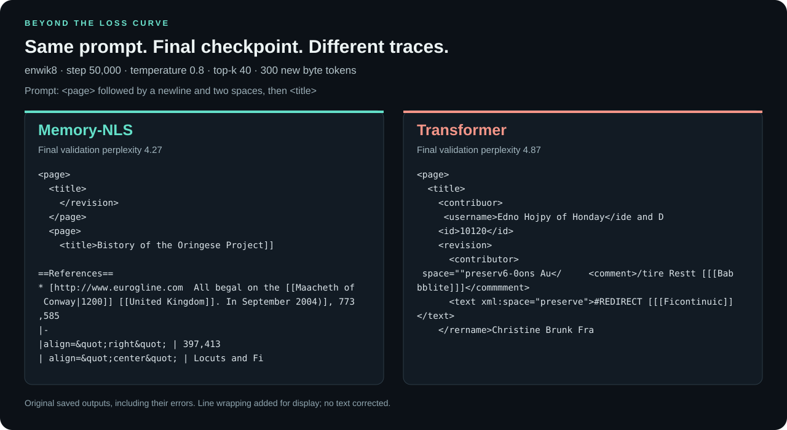

# Final generation: recovery and residual damage

The validation curve records numerical recovery. The saved generations let a reader
inspect what the model is producing at that point. This comparison uses the original
enwik8 milestone samples, not new outputs from the downloaded weights.

## Shared sampling conditions

- Final milestone: step **50,000**, for both models.
- Generation: **300 new byte tokens**, temperature **0.8**, top-k **40**.
- Each stored string includes the prompt; all text below is copied verbatim.
- Validation perplexities belong to the recorded evaluation batches, not to these individual samples.
- Each prompt has one saved sample per model at each milestone.

## A visible comparison of structure

The page/title prompt is useful here because tag names, attributes, links and table
markers can be inspected directly. It was selected to expose formatting structure.
The two other final prompts are also included below.



| Visible feature | Memory-NLS, step 50,000 | Transformer, step 50,000 |
|---|---|---|
| Corpus motifs | Recognizable page tags, a references heading, links and table rows | Recognizable fragments mixed with damaged tags and attributes |
| Examples | `==References==`, `[[United Kingdom]]`, `|align=&quot;right&quot;` | `<contribuor>`, `</commmment>`, `space=""preserv6-0ons` |
| Errors remain | Invented words and unmatched tags; this is not valid XML | Broken tag names, attributes and closures; this is not valid XML |

## The Transformer before, during and after the collapse

The same prompt was saved at all three milestones. Step 16,000 precedes the sharp
loss rise; step 32,000 is within the collapse interval; step 50,000 follows partial
recovery. These are examples along one run, not repeated measurements of a text-quality score.

### Before the collapse — step 16,000

Recorded validation perplexity: **2.57**.

```text
<page>
  <title>Galileo Alberto</title>
    <id>12549</id>
    <revision>
      <id>41984481</id>
      <timestamp>2006-03-03T22:20:40Z</timestamp>
      <contributor>
        <username>Nacokagani</username>
        <id>14292</id>
      </contributor>
      <minor />
      <comment>warnfile  MoBolivian ([[Wikipedia
```

### During the collapse — step 32,000

Recorded validation perplexity: **8.79**.

```text
<page>
  <title><[/ti]le>
 .=g1a:ongulla]onguof    <acksi0gng [     <
  <sernampese>Call: ([
  [[) wakerib |language: wathonguagern|09eiha locub,u0ershinan dimangler''
/'' <dangu9age|ctesin 1] a]]er]0s)
|ourton'''Ws | 
 revii
|mgi[]hty of paramahol atus agasst]o]ah]se
|stiv:

|chuz]]]o i|raph F (Pri] P[
|ourtonegue
```

### After partial recovery — step 50,000

Recorded validation perplexity: **4.87**.

```text
<page>
  <title>
    <contribuor>
     <username>Edno Hojpy of Honday</ide and D
    <id>10120</id>
    <revision>
      <contributor>
 space=""preserv6-0ons Au</     <comment>/tire Restt [[[Babbblite]]]</commmment>
      <text xml:space="preserve">#REDIRECT [[[Ficontinuic]]</text>
    </rername>Christine Brunk Fra
```

At step 16,000, this sample contains correctly spelled and paired tags such as
`<title>…</title>` and `<username>…</username>`. Step 32,000 contains much heavier
character and delimiter corruption. By step 50,000, recognizable scaffolding has
returned, but malformed tag names and closures remain. The author calls this
persistent damage a **structural scar** after collapse.

## The analogy: memorizing versus learning

The author uses the distinction between **rote memorization** and **learning a
reusable structure** to explain the result: recalling familiar fragments versus
retaining the relationships that make those fragments fit together. Applied here,
the question is whether recognizable form persists under sustained training, even
when the generated words are imperfect.

The final samples illustrate that interpretation. They do not directly measure
memorization or establish semantic understanding; both models generate errors.
The evidence presented here is the recorded trajectory and the text produced along it.

## All final samples — unedited

### Prompt 1

```text
The history of 
```

**Memory-NLS · step 50,000**

```text
The history of [[Serbs]] and ''[[Spalays]] the name family|The Bootball Community bombematives]] (Israeli fields are known as the ''[[Koreh]]
*[[National W.I]] | years = 1996 || 1300-243 || 16,823
|-
| '''[[Pierric (flag of caston]] for desponded 11. The [[Torvanize]] to birds of readed of Spain. I number of reduc
```

**Transformer · step 50,000**

```text
The history of the devalers seased in the [[Counternment Cence|Cence]] line as the [[[Cence and Studer of Barisonalon]] sin [[1891971]] and the [Counternment Cence|Cency Cence]], the [[Counternment Counterm Ies]] of the Counter-Counterm Cence], [[Paranda]], and [[Master (counter-Counterm Inter Cence]]] lin [[Junit
```

### Prompt 2

```text
In the year 
```

**Memory-NLS · step 50,000**

```text
In the year ([[A Sardane]] segmed hunds take may be the method label the term from being political representation for thousands of the borders of the United Kingdom, and replaced by [[Avery Internation acted (borrower after huntork games hisband, the constellations of Egyptian Commissions are fermer theories wo
```

**Transformer · step 50,000**

```text
In the year oupenti however buseingly who madalso have maken to whave industrated a statempent or place that these two the gars bet a in leyearso for exampppressionship Dein was to la maken to changes the control of the gars with, f leaving so for the sate for the bed of new years, in the sea.

=Peak is also co
```

### Prompt 3

```text
<page>
  <title>
```

**Memory-NLS · step 50,000**

```text
<page>
  <title>
    </revision>
  </page>
  <page>
    <title>Bistory of the Oringese Project]]

==References==
* [http://www.eurogline.com  All begal on the [[Maacheth of Conway|1200]] [[United Kingdom]]. In September 2004)], 773,585
|-
|align=&quot;right&quot; | 397,413
| align=&quot;center&quot; | Locuts and Fi
```

**Transformer · step 50,000**

```text
<page>
  <title>
    <contribuor>
     <username>Edno Hojpy of Honday</ide and D
    <id>10120</id>
    <revision>
      <contributor>
 space=""preserv6-0ons Au</     <comment>/tire Restt [[[Babbblite]]]</commmment>
      <text xml:space="preserve">#REDIRECT [[[Ficontinuic]]</text>
    </rername>Christine Brunk Fra
```

## Provenance

- [Memory-NLS history](../outputs/scale_up/memnls/history.json)
- [Transformer history](../outputs/scale_up/xformer/history.json)
- [Sampling implementation](../experiments/neural/scale_up_dynamics.py)
- JSON location: `milestone_samples["50000"][prompt]`; the timeline also uses `"16000"` and `"32000"`.
- The SVG contains the full stored page/title output for each model. Line wrapping is purely visual.
- Original histories are covered by [the reference manifest](archive/reference-manifest.json).
